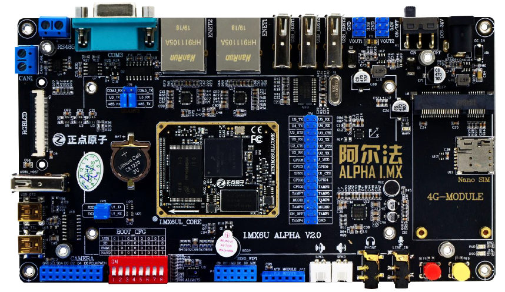
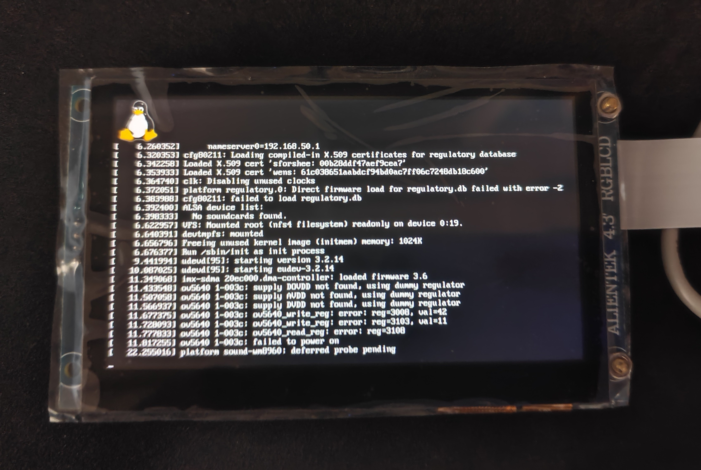

# v6.6.x内核版本下正点原子I.MX6ULL开发板适配正点原子LCD模块

## 概述

正点原子的I.MX6ULL开发板的配套教程使用的是v4.1.5版本的内核，而现在（2026.06）内核的版本已经更新到了v7，笔者非常想将新内核适配到开发板中，所以有了这篇文章。本文介绍了如何在v6.6.141版本内核下正点原子的RGBLCD模块——ATK-4384，所使用的开发板为EMMC-8GB版的alpha开发板。




## 具体步骤

### 内核移植

在www.kernel.org上可以直接下载到v6.6.x版本的内核压缩包。

> 或者：`git clone https://git.kernel.org/pub/scm/linux/kernel/git/stable/linux.git`获取代码，之后`git checkout v6.6.141`切换到v6.6.141版本。

进入源码目录后，先配置环境变量，这里工具链的前缀需要按照读者安装的具体工具链来写，比如我是从arm官网上下载的arm-none-linux-gnueabihf。

```sh
export ARCH=arm
export CROSS_COMPILE=arm-none-linux-gnueabihf-
```

接着`make imx_v6_v7_defconfig`应用针对imx6的config文件，再`make`先编译一次内核，确保没有其他问题。

趁着编译的时间，看一下有关LCD的代码。

#### 设备树相关

nxp官方的evk板子的设备树文件在_arch/arm/boot/dts/imx/nxp/_文件夹下，名为`imx6ull-14x14-evk.dts`，它的内容很少，只包含了两条`#include`语句和两条设备树语句：

```dts
// SPDX-License-Identifier: (GPL-2.0 OR MIT)
//
// Copyright (C) 2016 Freescale Semiconductor, Inc.

/dts-v1/;

#include "imx6ull.dtsi"
#include "imx6ul-14x14-evk.dtsi"

/ {
	model = "Freescale i.MX6 UltraLiteLite 14x14 EVK Board";
	compatible = "fsl,imx6ull-14x14-evk", "fsl,imx6ull";
};

&clks {
	assigned-clocks = <&clks IMX6UL_CLK_PLL3_PFD2>;
	assigned-clock-rates = <320000000>;
};
```

从这里就可以看出v6.6.x版本和v4.1.5版本的不同了，新版本的设备树更多地使用到了设备树的增量更新功能（Device Tree Overlays / DTO），显得更加简洁。

再找到它所包含的`imx6ul-14x14-evk.dtsi`文件，这个文件就包含了比较多的节点描述，例如本文最关心的节点`lcdif`：

```
// imx6ul-14x14-evk.dtsi
&lcdif {
	assigned-clocks = <&clks IMX6UL_CLK_LCDIF_PRE_SEL>;
	assigned-clock-parents = <&clks IMX6UL_CLK_PLL5_VIDEO_DIV>;
	pinctrl-names = "default";
	pinctrl-0 = <&pinctrl_lcdif_dat
		     &pinctrl_lcdif_ctrl>;
	status = "okay";

	port {
		display_out: endpoint {
			remote-endpoint = <&panel_in>;
		};
	};
};
```

它描述了这个`lcdif`外设的信息，比如引脚信息`pinctrl-0 = <&pinctrl_lcdif_dat &pinctrl_lcdif_ctrl>;`、端口`port{...}`。其中port节点下的endpoint子节点的remote-endpoint属性指定了一个引用（phandle）`panel_in`。在这个文件下搜索`panel_in`，可以找到：

```
// imx6ul-14x14-evk.dtsi
/{
	...
    panel {
        compatible = "innolux,at043tn24";
        backlight = <&backlight_display>;

        port {
            panel_in: endpoint {
                remote-endpoint = <&display_out>;
            };
        };
    };
    ...
};
```

说明evk板子上的显示屏已经有了适配的驱动了，内核可以通过`"innolux,at043tn24"`这个属性值在设备树中找到这个节点所对应的驱动。

为了适配正点原子的LCD屏幕，我们就需要修改panel这个节点。复制一份`imx6ull-14x14-evk.dts`文件并重命名为`imx6ull-alientek-emmc.dts`，并将内容修改为：

```
/dts-v1/;

#include "imx6ull.dtsi"
#include "imx6ul-14x14-evk.dtsi"

/ {
	model = "Freescale i.MX6 UltraLiteLite 14x14 EVK Board";
	compatible = "fsl,imx6ull-14x14-evk", "fsl,imx6ull";
};
...
&pinctrl_lcdif_ctrl {
	fsl,pins = <
		MX6UL_PAD_LCD_CLK__LCDIF_CLK	      0x79
		MX6UL_PAD_LCD_ENABLE__LCDIF_ENABLE  0x79
		MX6UL_PAD_LCD_HSYNC__LCDIF_HSYNC    0x79
		MX6UL_PAD_LCD_VSYNC__LCDIF_VSYNC    0x79
		MX6UL_PAD_LCD_RESET__LCDIF_RESET    0x79 // 这里添加了RESET引脚，对应芯片的GPIO3_IO04
	>;
};

// &lcdif {...}; 外设lcdif不需要修改

&{/panel} { // 由于panel节点没有标签，所以通过路径的方式指定
	compatible = "alientek,atk4384"; // 自定义的compatible值，可以改成其他的，但是要和内核中的compatible值一样
	backlight = <&backlight_display>;

	port {
		panel_in: endpoint {
			remote-endpoint = <&display_out>;
		};
	};
};

&wdog1 {
  status = "disabled"; // 看门狗占用了LCD的RESET引脚，所以禁用掉
};
...
```

这样，设备树相关的代码就修改完毕了。

#### 内核相关

在内核源码中搜索`"innolux,at043tn24"`这个字符串，可以找到：

```C
static const struct drm_display_mode innolux_at043tn24_mode = {
	.clock = 9000,
	.hdisplay = 480,
	.hsync_start = 480 + 2,
	.hsync_end = 480 + 2 + 41,
	.htotal = 480 + 2 + 41 + 2,
	.vdisplay = 272,
	.vsync_start = 272 + 2,
	.vsync_end = 272 + 2 + 10,
	.vtotal = 272 + 2 + 10 + 2,
	.flags = DRM_MODE_FLAG_NHSYNC | DRM_MODE_FLAG_NVSYNC,
};

static const struct panel_desc innolux_at043tn24 = {
	.modes = &innolux_at043tn24_mode,
	.num_modes = 1,
	.bpc = 8,
	.size = {
		.width = 95,
		.height = 54,
	},
	.bus_format = MEDIA_BUS_FMT_RGB888_1X24,
	.connector_type = DRM_MODE_CONNECTOR_DPI,
	.bus_flags = DRM_BUS_FLAG_DE_HIGH | DRM_BUS_FLAG_PIXDATA_DRIVE_POSEDGE,
};

static const struct of_device_id platform_of_match[] = {
...
    {
        .compatible = "innolux,at043tn24",
        .data = &innolux_at043tn24,
    },
...
};
```

这就是驱动evk板子上的LCD模块所需要的信息。接下来，我们需要在内核中添加同样的信息，用于描述正点原子的LCD模块：

> 注意接下来是试错阶段，如果想看最终版本，可以跳到后一节

```C
static const struct drm_display_mode atk4384_mode = {
	.clock = 9200000,
	.hdisplay = 800,
	.hsync_start = 800 + 2,
	.hsync_end = 800 + 2 + 41,
	.htotal = 800 + 2 + 41 + 2,
	.vdisplay = 480,
	.vsync_start = 480 + 2,
	.vsync_end = 480 + 2 + 10,
	.vtotal = 480 + 2 + 10 + 2,
	.flags = DRM_MODE_FLAG_NHSYNC | DRM_MODE_FLAG_NVSYNC,
};

static const struct panel_desc atk4384 = {
	.modes = &atk4384_mode,
	.num_modes = 1,
	.bpc = 8,
	.size = {
		.width = 95,
		.height = 53,
	},
	.bus_format = MEDIA_BUS_FMT_RGB888_1X24,
	.connector_type = DRM_MODE_CONNECTOR_DPI,
	.bus_flags = DRM_BUS_FLAG_DE_HIGH | DRM_BUS_FLAG_PIXDATA_DRIVE_POSEDGE,
};
```

这里的panel_desc以及drm_display_mode结构体的各个成员的值是怎么确定的呢？可以看一下结构体声明时对各成员的描述，结构体声明在`drivers/gpu/drm/panel/panel-simple.c`和`include/drm/drm_modes.h`， 在代码中有非常详细的注释，读者可以自己看看代码。再根据正点原子给出的资料，不难确定各个成员的值。

感觉应该差不多了？编译再运行试试：

```
[    1.780801] panel-simple panel: supply power not found, using dummy regulator
[    1.788529] ------------[ cut here ]------------
[    1.793319] WARNING: CPU: 0 PID: 1 at drivers/gpu/drm/panel/panel-simple.c:516 panel_simple_probe+0x578/0x6ec
[    1.803410] Modules linked in:
[    1.806531] CPU: 0 PID: 1 Comm: swapper/0 Not tainted 6.6.141 #11
[    1.812690] Hardware name: Freescale i.MX6 Ultralite (Device Tree)
[    1.818937]  unwind_backtrace from show_stack+0x10/0x14
[    1.824275]  show_stack from dump_stack_lvl+0x40/0x4c
[    1.829440]  dump_stack_lvl from __warn+0x8c/0xf4
[    1.834233]  __warn from warn_slowpath_fmt+0x130/0x1f8
[    1.839472]  warn_slowpath_fmt from panel_simple_probe+0x578/0x6ec
[    1.845756]  panel_simple_probe from platform_probe+0x60/0xcc
[    1.851598]  platform_probe from really_probe+0xc4/0x2e0
[    1.857006]  really_probe from __driver_probe_device+0x90/0x1c4
[    1.863007]  __driver_probe_device from driver_probe_device+0x30/0x114
[    1.869616]  driver_probe_device from __driver_attach+0x9c/0x198
[    1.875705]  __driver_attach from bus_for_each_dev+0x7c/0xd0
[    1.881447]  bus_for_each_dev from bus_add_driver+0xc0/0x1e8
[    1.887184]  bus_add_driver from driver_register+0x84/0x138
[    1.892834]  driver_register from panel_simple_init+0x10/0x48
[    1.898673]  panel_simple_init from do_one_initcall+0x58/0x270
[    1.904596]  do_one_initcall from kernel_init_freeable+0x168/0x210
[    1.910867]  kernel_init_freeable from kernel_init+0x14/0x140
[    1.916710]  kernel_init from ret_from_fork+0x14/0x20
[    1.921847] Exception stack(0xe0845fb0 to 0xe0845ff8)
[    1.926957] 5fa0:                                     00000000 00000000 00000000 00000000
[    1.935210] 5fc0: 00000000 00000000 00000000 00000000 00000000 00000000 00000000 00000000
[    1.943455] 5fe0: 00000000 00000000 00000000 00000000 00000013 00000000
[    1.950206] ---[ end trace 0000000000000000 ]---
[    1.954896] panel-simple panel: Reject override mode: panel has a fixed mode
[    1.971944] [drm] Initialized mxsfb-drm 1.0.0 20160824 for 21c8000.lcdif on minor 0
```

然而报错了。在内核中开启debug信息，再重新编译，然后使用`arm-none-linux-gnueabihf-objdump`将panel-simple.o文件反汇编，查看出错位置。根据报错的信息，可以知道，在panel_simple_probe+0x578处。在`objdump`的输出中找到：

```C
/home/budali11/imx6u-workbench/linux/drivers/gpu/drm/panel/panel-simple.c:517
		dev_err(dev, "Reject override mode: panel has a fixed mode\n");
 d8c:	e59f1140 	ldr	r1, [pc, #320]	@ ed4 <panel_simple_probe+0x6c0>
 d90:	e1a00005 	mov	r0, r5
 d94:	ebfffffe 	bl	0 <_dev_err>
```

内核源码中：

```C
static void panel_simple_parse_panel_timing_node(struct device *dev,
						 struct panel_simple *panel,
						 const struct display_timing *ot)
{...
if (WARN_ON(desc->num_modes)) {
    dev_err(dev, "Reject override mode: panel has a fixed mode\n");
    return;
}
...}
```

发现是desc的num_modes成员不为0触发了报错。仔细阅读代码，发现这个函数`panel_simple_parse_panel_timing_node`似乎假定了`desc`结构体中必须使`num_timings`成员的值不为0，即必须有一个或以上的`display_timing`结构体。如果`num_timings`大于1，多个结构体应该以数组形式定义，并把首地址赋给`desc->timings`成员；如果`num_timings`为1，可以直接把定义的`display_timing`结构体的地址赋给`desc->timings`成员。

#### 内核最终修改

根据上一节的发现，在`panel-simple.c`中添加如下代码：

```C
static const struct display_timing atk4384_timings = {
    // 这些参数都是通过正点原子所给出的资料获得的
    .pixelclock = {9200000, 30000000, 50000000},
    .hactive = {800, 800, 800},
    .vactive = {480, 480, 480},
    .hfront_porch = {4, 5, 65},
    .hback_porch = {36, 40, 255},
    .hsync_len = {1, 48, 255},
    .vfront_porch = {2, 8, 93},
    .vback_porch = {3, 8, 31},
    .vsync_len = {3, 3, 255},
    .flags = DISPLAY_FLAGS_VSYNC_LOW 
      | DISPLAY_FLAGS_HSYNC_LOW 
      | DISPLAY_FLAGS_DE_HIGH 
      | DISPLAY_FLAGS_PIXDATA_NEGEDGE,
};

static const struct panel_desc atk4384 = {
    .num_timings = 1,
    .timings = &atk4384_timings,
	.bpc = 8,
	.size = {
		.width = 95,
		.height = 53,
	},
	.bus_format = MEDIA_BUS_FMT_RGB888_1X24,
	.connector_type = DRM_MODE_CONNECTOR_DPI,
	.bus_flags = DRM_BUS_FLAG_DE_HIGH | DRM_BUS_FLAG_PIXDATA_DRIVE_POSEDGE,
};

static const struct of_device_id platform_of_match[] = {
    ...,
    {
        .compatible = "alientek,atk4384",
        .data = &atk4384,
    }, {
        /* Must be the last entry */
        .compatible = "panel-dpi",
        .data = &panel_dpi,
    }, {
		/* sentinel */
    }
};
```

### 编译运行

```sh
export ARCH=arm
export CROSS_COMPILE=arm-none-linux-gnueabihf-
make LOCALVERSION= -j12 #如果你用git仓库
make -j12 #如果你用压缩包
```

笔者这里使用NFS挂载根文件系统，使用buildroot编译的uboot，内核镜像zImage和设备树镜像.dtb放在tftp文件夹下，bootargs设置为：

```bash
'console=tty1 console=ttymxc0,115200 root=/dev/nfs nfsroot=192.168.50.169:/home/budali11/imx6u-workbench/nfs,nfsvers=4 ip=dhcp'
```

定义环境变量myboot为：

```sh
'tftp 80800000 zImage; tftp 83000000 imx6ull-alientek-emmc.dtb; bootz 80800000 - 83000000'
```

在uboot中运行`run myboot`，等待内核启动。LCD成功显示出调试信息及开机logo：



## 参考

笔者在完成移植时，参考了一些文档：

